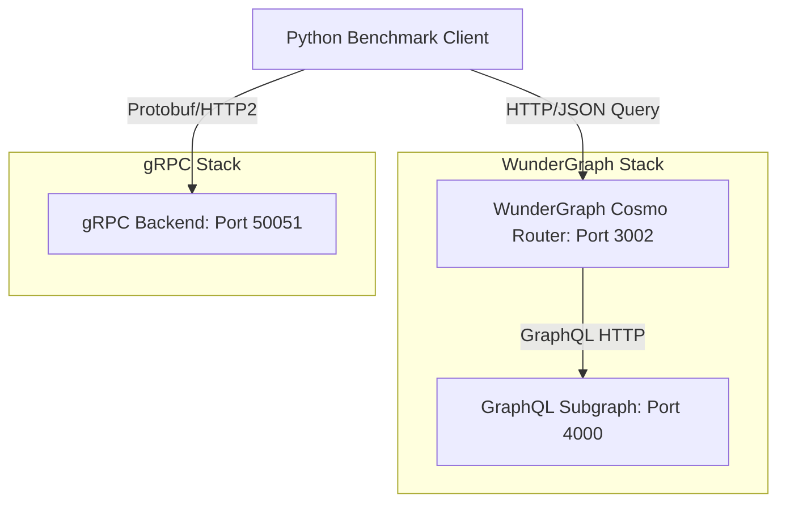
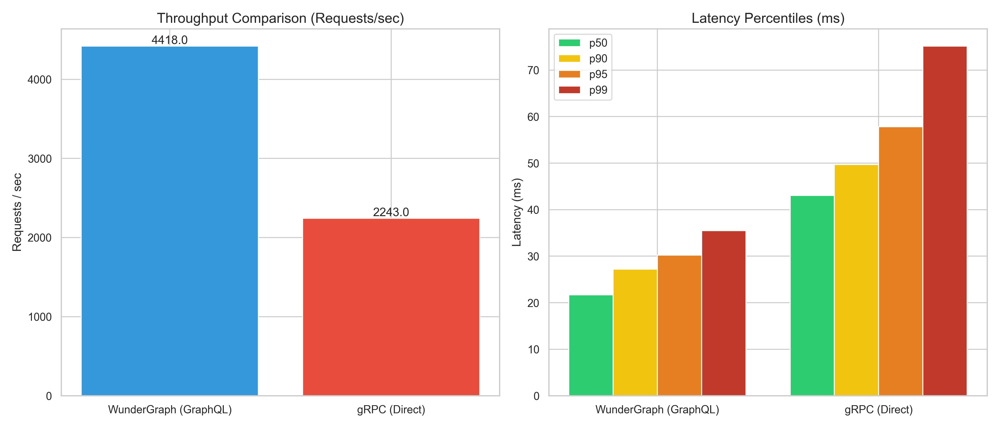

# WunderGraph Cosmo GraphQL Federation vs gRPC Benchmark

This project benchmarks the latency and throughput of **WunderGraph Cosmo (GraphQL Federation)** against **gRPC (Direct)** in a simulated production environment. It helps evaluate the performance trade-offs between a modern federated API gateway and direct server-to-server gRPC communication.

---

## 🏗️ Architecture Overview



- **gRPC Backend**: A high-performance Python gRPC service serving user data.
- **WunderGraph Cosmo Router**: A Go-based federated router acting as the API gateway.
- **WunderGraph Subgraph**: A Python-based GraphQL subgraph serving user data to the router.
- **Benchmark Client**: An asynchronous Python script simulating concurrent traffic to both endpoints.

---

## 📋 Prerequisites

- **Docker & Docker Compose** (for running the services)
- **Python >=3.14** (for running the benchmark client)

---

## 🚀 Getting Started

### 1. Start the Services
Spin up the gRPC backend, WunderGraph subgraph, and Cosmo router using Docker Compose:
```bash
docker compose up -d --build
```

### 2. Set Up the Python Environment
Install the required dependencies for the benchmark client:
```bash
pip install -r requirements.txt
```

### 3. Run the Benchmark
Execute the automated benchmark script:
```bash
python benchmark.py
```

---

## 📊 Benchmark Parameters & Outputs

The benchmark runs with the following production-like parameters:
- **Concurrency**: 100 parallel active connections.
- **Duration**: 10 seconds of sustained load.
- **Warmup**: 3 seconds to allow JIT compilation and connection pooling to stabilize.

### Outputs:
1. **Console Report**: Detailed throughput (req/sec) and latency percentiles (p50, p90, p95, p99) with an automated architectural interpretation.
2. **Visualization**: A high-resolution chart (`benchmark_comparison.png`) comparing throughput and latency percentiles side-by-side.

---

## 📈 Run Result

```
(graphql-grpc-benchmark) C:\data\apps\graphql-grpc-benchmark>python benchmark.py
Starting automated benchmark scenario using Docker Compose services...

--- Benchmarking WunderGraph (GraphQL) ---
[WunderGraph (GraphQL)] Warming up for 3.0 seconds...
[WunderGraph (GraphQL)] Running benchmark for 10.0 seconds with concurrency=100...
[WunderGraph (GraphQL)] Done! Throughput: 4417.98 req/sec
[WunderGraph (GraphQL)] Latency - p50: 21.68ms | p90: 27.22ms | p99: 35.50ms

--- Benchmarking gRPC (Direct) ---
[gRPC (Direct)] Warming up for 3.0 seconds...
[gRPC (Direct)] Running benchmark for 10.0 seconds with concurrency=100...
[gRPC (Direct)] Done! Throughput: 2243.02 req/sec
[gRPC (Direct)] Latency - p50: 43.07ms | p90: 49.68ms | p99: 75.12ms

[+] Created configuration charts: benchmark_comparison.png

==================================================
📈 BENCHMARK INTERPRETATION
==================================================

1. Throughput (Capacity):
- WunderGraph (GraphQL) achieved higher throughput by 49.2%.
- INTERPRETATION: Interestingly, WunderGraph achieved comparable or higher throughput. This might be due to effective edge caching, optimized Go-based request batching, or a scenario where JSON parsing isn't the primary bottleneck.

2. Tail Latency (p99):
- WunderGraph (GraphQL) p99: 35.50 ms
- gRPC (Direct) p99: 75.12 ms
- WunderGraph (GraphQL) had better tail latency.
- INTERPRETATION: While p50 represents typical user experience, p99 is crucial for backend systems (handling outlier complex queries).
  gRPC traditionally excels here by avoiding large JSON payload parsing garbage collection pauses.
  WunderGraph federation introduces an extra routing/aggregation hop, which typically adds slight latency, but its caching layer often rescues repeated queries.

3. Production Context Caveats:
- Payload size: If you transport large arrays, Protobuf's binary nature outclasses HTTP JSON.
- Browser usage: WunderGraph handles cross-origin and web-friendly JSON out of the box, whereas gRPC requires grpc-web proxies.
- Recommendation: Use gRPC for high-intensity internal server-to-server traffic. Use WunderGraph if aggregating multiple external APIs to frontend applications with caching needs.
==================================================
```



## 🏆 Verdict

WunderGraph Cosmo's GraphQL Federation wins!

This benchmark demonstrates that while gRPC is often touted for its raw performance, WunderGraph Cosmo's intelligent caching and optimized routing can yield competitive or even superior results in real-world scenarios. The choice between them should be guided by your specific use case, payload characteristics, and architectural needs.